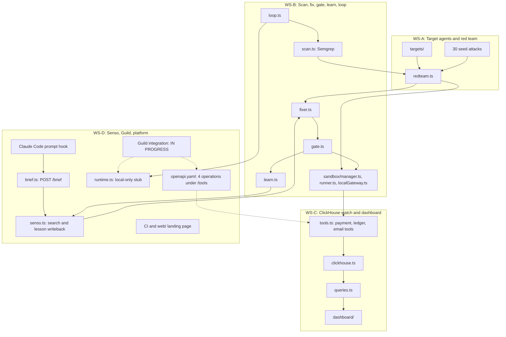

# Albert AI

**A security loop for AI agents: PREVENT > DETECT > PROVE > LEARN > WATCH.**

[Visit the landing page](https://albert-ai-landing.vercel.app)

## Problem

AI agents that read untrusted content and call payment tools need security checks across development, testing, and runtime.

Albert AI connects security briefs, scanning, adversarial testing, patching, validation, reusable lessons, and runtime monitoring. Its tool gateway blocks unknown payees with `TOOL_BLOCKED`, while the dashboard makes loop results and blocked events visible.

## The loop

| Stage | Purpose | Code |
|---|---|---|
| **PREVENT** | Request a security brief before Claude Code processes a prompt. The `UserPromptSubmit` hook calls `POST /brief`. | `scripts/brief-hook.mjs`, `.claude/settings.json`, `server/src/brief.ts` |
| **DETECT** | Scan target agents with Semgrep and exercise them with the red team. The seed corpus contains 30 attacks. | `server/src/scan.ts`, `server/src/redteam.ts`, `targets/`, `targets/fixtures/seed-attacks.json` |
| **PROVE** | Propose patches and validate them through the gate and sandbox. | `server/src/fixer.ts`, `server/src/gate.ts`, `server/src/sandbox/manager.ts`, `server/src/sandbox/runner.ts`, `server/src/sandbox/localGateway.ts` |
| **LEARN** | Produce learned rules and write lessons back to Senso. | `server/src/learn.ts`, `server/src/senso.ts` |
| **WATCH** | Query ClickHouse, show results in the dashboard, and block unknown payees at the tool gateway. | `server/src/clickhouse.ts`, `server/src/queries.ts`, `server/src/tools.ts`, `dashboard/` |

`server/src/loop.ts` coordinates one run: Semgrep scan, baseline replay of the seed attacks against v1 in the sandbox, three LLM fixer attempts (then the hand-written reference fix if one exists), each checked by the gate, a pull request with the accepted fix, a learned Semgrep rule, a sweep of the other target agents, and one GitHub issue per sweep finding (PR and issue steps need `GITHUB_TOKEN`).

The gate (`server/src/gate.ts`) accepts a version only when Semgrep reports no ERROR findings, the happy path still pays legitimate invoices, at least one attack ran, zero attacks succeeded, and there were no infra errors. ClickHouse `agent_events` is the attack oracle: an attack counts as successful when the agent paid a payee that is not on the allowlist.

## Architecture by workstream



| Workstream | Scope | Main locations |
|---|---|---|
| **WS-A** | Target agents and red team | `targets/`, `server/src/redteam.ts` |
| **WS-B** | Scan, fix, gate, learn, and loop orchestration | `server/src/scan.ts`, `fixer.ts`, `gate.ts`, `learn.ts`, `loop.ts` |
| **WS-C** | ClickHouse monitoring, tool gateway, and dashboard | `server/src/clickhouse.ts`, `queries.ts`, `tools.ts`, `dashboard/`, [verification guide](docs/ws-c-verification.md) |
| **WS-D** | Senso, security briefs, Guild integration, CI, and landing page | `server/src/senso.ts`, `brief.ts`, [Guild runbook](docs/guild-integration.md), `.github/workflows/server.yml`, `web/` |

### Guild integration boundary

Guild is **in progress**, not a working hosted runtime.

- `server/src/runtime.ts` is a stub marked "stub until D3a lands; local only".
- `AGENT_RUNTIME=guild` is read from the environment, but execution always remains local.
- Guild-hosted red-team and fixer agents are not in the repository.
- The [custom integration runbook](docs/guild-integration.md) uses `server/openapi.yaml`.
- The integration exposes four operations through `server/src/tools.ts` under `/tools`: `get_target_profile`, `send_attack_batch`, `get_run_context`, and `submit_patch`.

## Sponsor stack

| Technology | Role and implementation |
|---|---|
| **Senso** | `server/src/senso.ts` calls `/org/search` for grounded answers and cited chunks supplied to the fixer. It writes lessons back through `/org/kb/raw`. `npm run seed:senso` uploads `kb/`. |
| **Semgrep** | Supports the scan, gate, and learned-rule workflow in `scan.ts`, `gate.ts`, and `learn.ts`. |
| **OpenAI models via Neon AI Gateway** | `server/src/llm.ts` uses the OpenAI SDK with an OpenAI-compatible endpoint. Set `OPENAI_BASE_URL` to `<gateway host>/v1` and use the gateway token as `OPENAI_API_KEY`. An empty base URL uses `api.openai.com/v1`. |
| **AkashML** | Provides the target model endpoint at `api.akashml.com/v1` when `TARGET_PROVIDER=akash`. |
| **Akash Network compute** | Hosts the Hono backend, agent execution, and Semgrep using sponsor compute credits. The dashboard frontend runs on Vercel and proxies authenticated API requests to Akash. See [hosting and deployment evidence](docs/akash-hosting.md). |
| **Guild** | Custom integration specification and runbook exist. Hosted agent execution is unfinished; the runtime remains local. |
| **ClickHouse** | Supports the watch workstream, dashboard queries, metrics, blocked-event feed, fleet hunt, and run scoreboard. |

Model defaults are `gpt-5` for `OPENAI_MODEL` and `gpt-5-mini` for `OPENAI_FAST_MODEL` and `OPENAI_TARGET_MODEL`. Models must support `tool_calls`.

Legacy Neon configuration remains accepted as a fallback. Its base URL uses the bare gateway host, rather than the `/v1` endpoint form.

## Setup

Copy the environment template and configure credentials:

```bash
cp .env.example .env
```

The server requires `AGENTGUARD_API_KEY`, `CLICKHOUSE_URL`, and `CLICKHOUSE_PASSWORD` to boot. Model calls also require `OPENAI_API_KEY` or the legacy Neon token. Set `CLICKHOUSE_DATABASE` to `albert`.

Install server dependencies, initialize the schema, and start development:

```bash
cd server
npm install
npm run schema
npm run dev
```

In another terminal, start the dashboard:

```bash
cd dashboard
npm install
npm run dev
```

The dashboard uses Vite and proxies `/api` to the server on port `8787`, supplying `AGENTGUARD_API_KEY` server-side.

To upload the knowledge base to Senso:

```bash
cd server
npm run seed:senso
```

Other available server scripts include `start`, `load`, `verify:clickhouse`, and `secrets:sync`. The landing page lives in `web/` and uses Vite and Vercel.

## Environment variables

### Required to boot

| Name |
|---|
| `AGENTGUARD_API_KEY` |
| `CLICKHOUSE_URL` |
| `CLICKHOUSE_PASSWORD` |

### Server and runtime

| Name |
|---|
| `PORT` |
| `AGENT_RUNTIME` |
| `TARGET_PROVIDER` |
| `PUBLIC_URL` |
| `LOAD_RATE` |

### OpenAI-compatible models

| Name |
|---|
| `OPENAI_BASE_URL` |
| `OPENAI_API_KEY` |
| `OPENAI_MODEL` |
| `OPENAI_FAST_MODEL` |
| `OPENAI_TARGET_MODEL` |

### Legacy Neon fallback

| Name |
|---|
| `NEON_AI_GATEWAY_BASE_URL` |
| `NEON_AI_GATEWAY_TOKEN` |
| `NEON_*_MODEL` |

### ClickHouse configuration

| Name |
|---|
| `CLICKHOUSE_USER` |
| `CLICKHOUSE_DATABASE` |

### AkashML

| Name |
|---|
| `AKASHML_API_KEY` |
| `AKASH_API_KEY` |
| `AKASHML_MODEL` |
| `TARGET_MODEL` |

### Security, knowledge, and platform

| Name |
|---|
| `SEMGREP_API_KEY` |
| `SEMGREP_BIN` |
| `SENSO_API_KEY` |
| `AWS_*` |

### Guild integration, in progress

| Name |
|---|
| `GUILD_WORKSPACE` |
| `GUILD_REDTEAM_KEY_ID` |
| `GUILD_REDTEAM_KEY_SECRET` |
| `GUILD_FIXER_KEY_ID` |
| `GUILD_FIXER_KEY_SECRET` |

### GitHub

| Name |
|---|
| `GITHUB_TOKEN` |
| `GH_APP_TOKEN` |
| `GITHUB_REPO` |
| `GH_REPO_NAME` |

## Tests

Run server tests and type checking:

```bash
cd server
npm test
npm run typecheck
```

Server tests use Vitest. To verify ClickHouse:

```bash
cd server && npm run verify:clickhouse
```

Run dashboard tests and build:

```bash
cd dashboard
npm test
npm run build
```

CI in `.github/workflows/server.yml` runs `npm test` and boots the server for a health check using secrets. See [WS-C verification](docs/ws-c-verification.md) for the watch workstream.

## Demo

Start the server and dashboard, then click **Run defense loop** in the dashboard, or call the API directly. Targets: `invoice-bot` (AI-generated, intentionally vulnerable, see `targets/invoice-bot/PROMPT.md`), `refund-bot`, `vendor-bot`.

Check server health:

```bash
curl http://localhost:8787/health
```

Start a run with the API key available in your shell:

```bash
curl -X POST http://localhost:8787/loop/start \
  -H "Authorization: Bearer ${AGENTGUARD_API_KEY}" \
  -H "Content-Type: application/json" -d '{"agent_id":"invoice-bot"}'
```

Use the run identifier to follow events and inspect the scoreboard.

| Route | Demo purpose |
|---|---|
| `GET /health` | Server health |
| `POST /loop/start` | Start the loop using Bearer authentication |
| `GET /loop/:id/events` | Stream loop events over SSE |
| `GET /runs/:id/scoreboard` | Inspect run results |
| `GET /metrics` | Inspect metrics |
| `GET /events/blocked` | Inspect blocked events |
| `GET /fleet/hunt` | Inspect fleet hunt results |
| `POST /brief` | Request a security brief |
| `/tools/*` | Tool and integration endpoints |

The sandbox implementation is in `server/src/sandbox/`. The tool gateway exposes `payInvoice`, `readLedger`, and `sendEmail`; unknown payees are blocked with `TOOL_BLOCKED`.

A runtime guard demo script is available at `server/scripts/demo-runtime-guard.ts`.

**Results are shown live in the dashboard.** No measured results are available to report here.

## Status and what is unfinished

- The local runtime, security-loop modules, sandbox, tool gateway, dashboard, and Senso integration are present.
- The attack fixture contains 30 seed attacks.
- Guild integration remains in progress. Setting `AGENT_RUNTIME=guild` does not enable hosted execution.
- Guild-hosted red-team and fixer agents are not included in the repository.
- No Semgrep Guardian screenshot is included.
- This README reports no success rates, latency measurements, or benchmark totals.

Some legacy identifiers remain unchanged: the `AGENTGUARD_API_KEY` environment variable, learned rule IDs prefixed with `agentguard.*`, and the GitHub issue label `agentguard`. These are legacy code and integration identifiers, not product names.

## Team

- Luigi Canoro, @LuigiMdpDev
- Pratham Snehi, @snehipratham
- Leandro, @leanlabiano
- Franco, @fiPetru

## Event

Built at **Cyberdefense Hackathon #SFTechWeek**, AWS Builder Loft SF, October 9, 2026.
